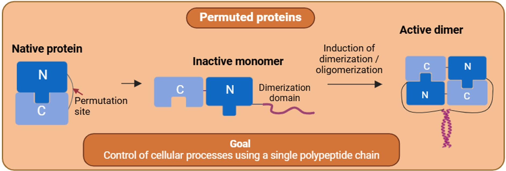

# PROPER -- Single-chain permuted proteins for dimerization-based control of protein activity and cellular processes

**[The google colab notebook enables the design of permuted "PROPER" proteins.](https://colab.research.google.com/github/ajasja/PROPER/blob/main/PROPER.ipynb)
**  [Click here to open](https://colab.research.google.com/github/ajasja/PROPER/blob/main/PROPER.ipynb)

If you use this notebook, please cite Ramuta et. al. bioRxiv, 2025, https://www.biorxiv.org/content/10.1101/2025.03.31.645681v1

Strategies for detecting and controlling protein interactions play a critical role in gaining an insight into molecular mechanisms of biological processes and for the control of cellular processes. Conditional protein reconstitution allows control of the selected protein function based on the proximity, defined by the genetically fused domain pairs, which may be regulated by chemical or biological signals. This typically requires two protein components in a stoichiometric ratio, which increases the complexity and genetic footprint with split segments often being unstable and prone to aggregation. To overcome this limitation, we developed an approach based on a permuted protein reconstitution by conditional dimerization (PROPER). According to this strategy, the N- and C-terminal domains of selected proteins are swapped and a loop replaced by a short linker that prevents the functionality of a monomeric protein, which reconstitutes only upon di- or oligomerization, controlled by a genetically fused domain that dimerizes by a chemical signal or senses a dimeric target. 

# Developer install

Create a virtual environment (for example using conda):
`conda create --name proper_conda python=3.11`

Activate the environment:

`conda activate proper_conda`

Install dependencies using conda, so no build tools are rquired. 
`conda install -c conda-forge mdtraj biopython py3Dmol pdb-tools ipykernel`

Install the package in editable mode:
`pip install -e .`
